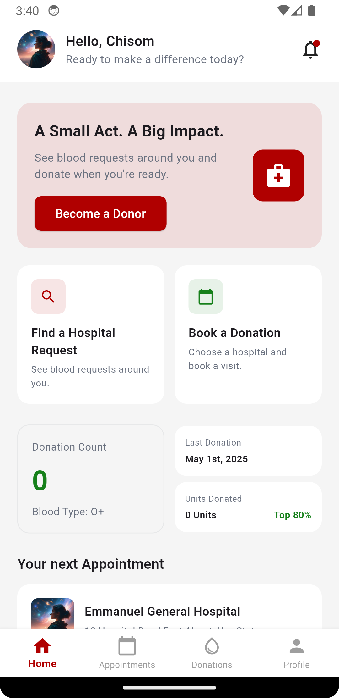
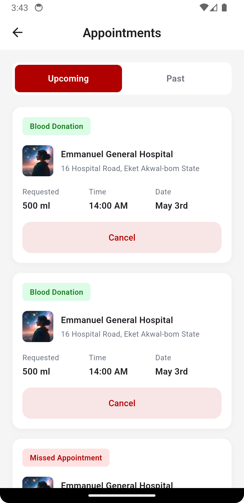
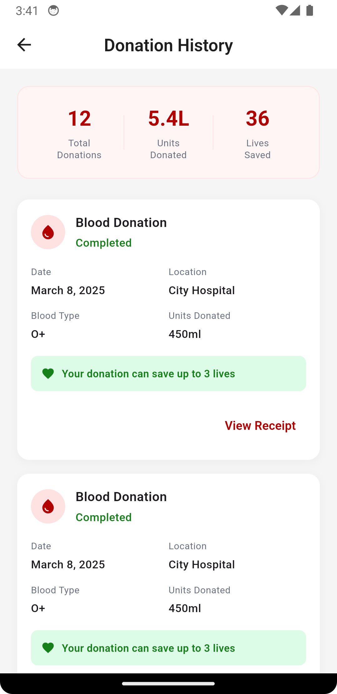
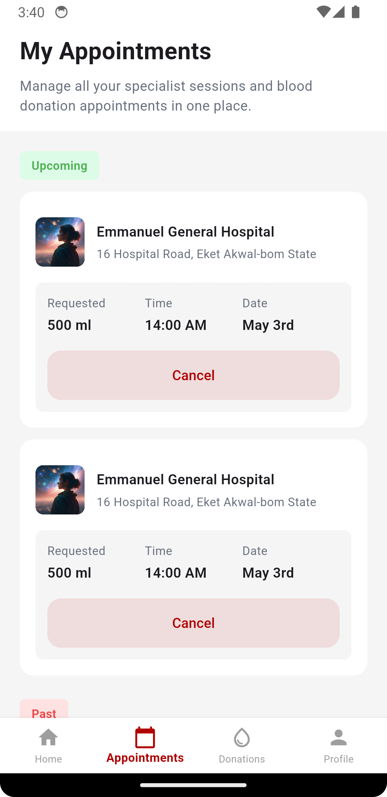
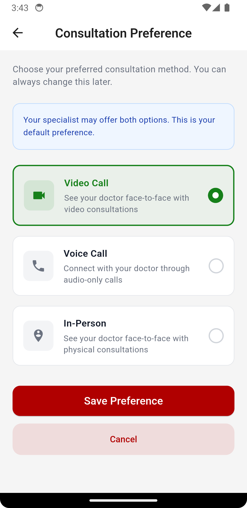
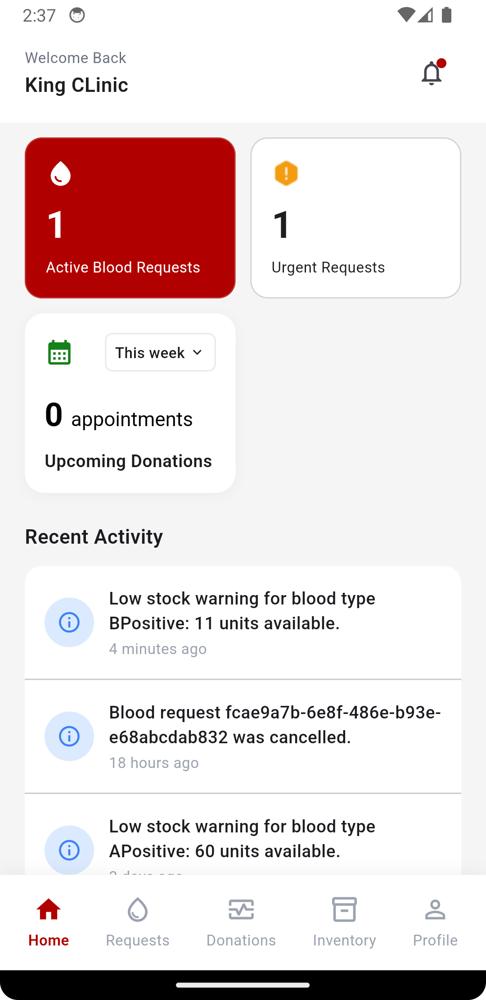
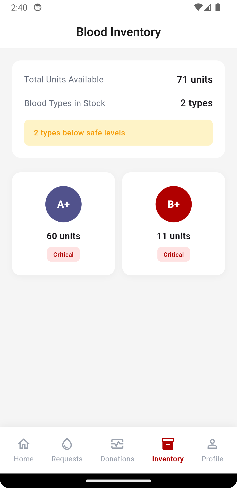
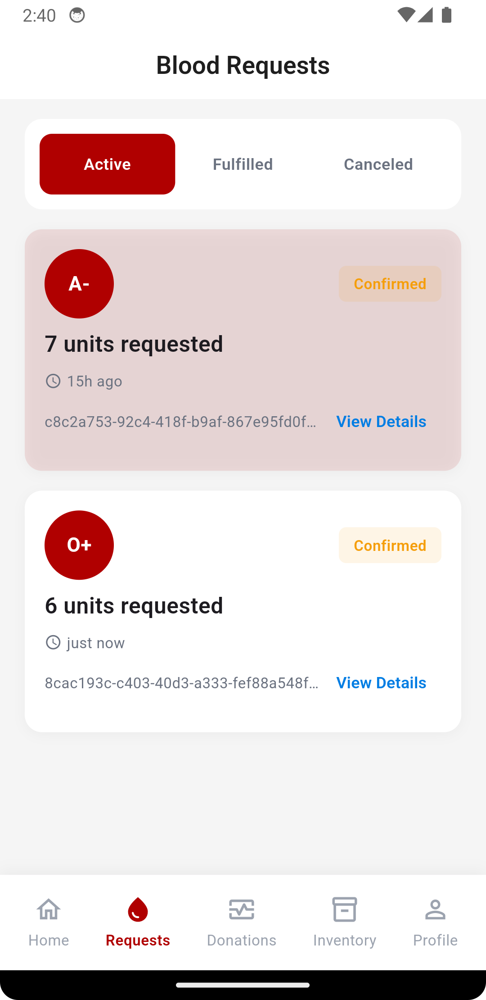
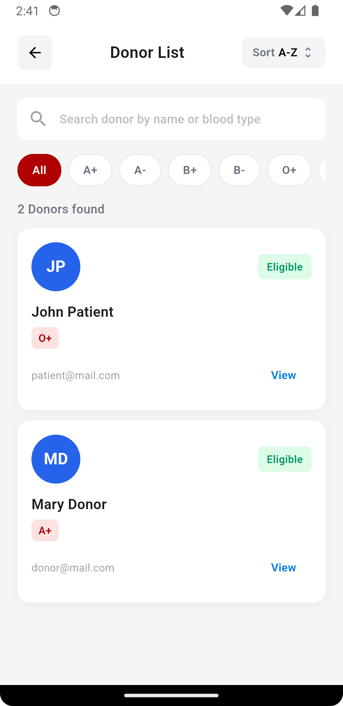
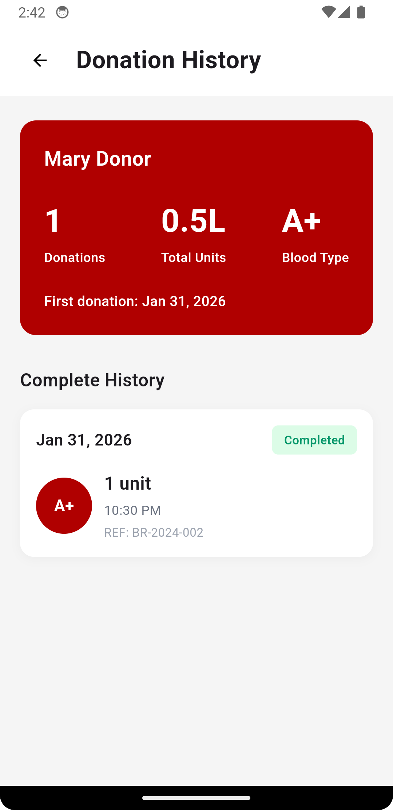

# HealthBridge - Digital Blood Donation Platform

A comprehensive mobile application connecting blood donors, hospitals, and patients to streamline blood donation requests, tracking, and management. Built with Flutter and clean architecture principles.

## 🎯 Project Overview

HealthBridge addresses critical challenges in blood donation management by creating a unified platform where:
- **Donors** can discover nearby hospitals, track donation history, and manage appointments
- **Hospitals** can manage blood inventory, post donation requests, and monitor donor activity
- **Patients** can request blood, view consultation preferences, and schedule appointments with specialists

The application supports three distinct user roles with tailored workflows and interfaces, ensuring a seamless experience for each stakeholder.

## 🛠️ Technology Stack

- **Framework**: Flutter (Dart)
- **State Management**: Provider (ChangeNotifier pattern)
- **Architecture**: Clean Architecture (Data, Domain, Presentation layers)
- **APIs**: REST endpoints with token-based authentication
- **Local Storage**: Secure storage (encrypted) for sensitive data & SharedPreferences
- **UI Framework**: Material Design 3
- **Routing**: GoRouter for type-safe navigation
- **Date Handling**: intl package for localization and formatting

## ✨ Key Features Implemented

### 1. **Donor Features**
- **Home Dashboard**: Personalized greeting, donation statistics, and next appointment overview
- **Nearby Hospital Discovery**: Location-based search with filtering by blood type and donor acceptance status
- **Donation History**: Complete tracking with donation dates, units, status, and impact metrics
- **Appointments Management**: View, schedule, reschedule, and cancel appointments with confirmation dialogs
- **Notification Settings**: Granular control over appointment reminders and donation alerts

### 2. **Hospital Features**
- **Inventory Management**: Real-time blood inventory tracking by blood type
- **Donation Requests**: Post and manage blood donation requests
- **Donor Management**: View donor database with filtering and search capabilities
- **Donation History**: Track all completed donations with donor information

### 3. **Specialist Features**
- **Appointment Management**: Comprehensive appointment workflow (Create → Confirm → Reschedule → Cancel)
- **Appointment Requests**: Review pending appointment requests from patients
- **Profile Management**: Complete specialist profile with credentials, availability, and consultation preferences
- **Appointment Details**: View detailed appointment information with real-time status updates
- **Appointment Confirmation**: Accept and schedule appointments with notifications

### 4. **Cross-Role Features**
- **Authentication**: Secure login with role-based access control
- **User Profiles**: Complete profile management including consultation preferences
- **Notifications Settings**: Unified settings screen for appointment reminders and alerts
- **Responsive Design**: Optimized layouts for various device sizes

## 🏗️ Architecture Highlights

### Clean Architecture Pattern
```
lib/
├── data/
│   ├── dataSource/       # API calls and local storage
│   ├── models/           # Data models with serialization
│   └── repositories/     # Data abstraction layer
├── presentation/
│   ├── providers/        # State management (ChangeNotifier)
│   ├── screens/          # UI pages organized by role
│   └── widgets/          # Reusable components
└── core/
    ├── constants/        # App-wide constants and endpoints
    ├── extension/        # Dart extensions
    └── utils/            # Helpers (dialogs, snackbars, etc.)
```

### State Management
- **Provider Pattern**: Uses ChangeNotifier for reactive UI updates
- **Consumer Widgets**: Efficient widget rebuilding with `Consumer<Provider>`
- **Post-Frame Callbacks**: Prevents setState during build phase
- **Computed Getters**: Model properties for formatted data (dates, units, colors)

### API Integration
- **Token-Based Auth**: Secure endpoints with JWT token headers
- **Error Handling**: Centralized error handling with `ResponseUtils`
- **Typed Responses**: `ResponseStatusM` model for consistent API responses
- **Endpoints**: 30+ integrated endpoints for user auth, appointments, inventory, donations, and profiles

## 📱 Key Screens & Features

### Donor Module (6 Screens)
| Screen | Key Features |
|--------|----------|
| **Home** | Stats display, upcoming appointments, impact metrics, pull-to-refresh |
| **Nearby Hospitals** | Location-based search, filtering, blood type chips, hospital cards |
| **Donations** | History list with status badges, formatted dates, impact details |
| **Donation Details** | Real-time status, reference ID, units, impact metrics |
| **Appointments** | Upcoming/past tabs, cancel with confirmation, reschedule, formatted dates |
| **Settings** | Notification preferences, consultation type selection |

### Specialist Module (5 Screens)
| Screen | Key Features |
|--------|----------|
| **Home** | Profile header, next appointment, appointment requests, recent activity |
| **Appointments List** | Upcoming/Completed/Missed tabs, Re-Schedule, Cancel buttons, real-time updates |
| **Appointment Details** | Full appointment info, Confirm/Cancel/Reschedule actions, status tracking |
| **Reschedule** | Calendar picker, time slot selection, confirmation dialog |
| **Profile Setup** | Complete specialist onboarding with credentials |

### Hospital Module (6 Screens)
| Screen | Key Features |
|--------|----------|
| **Home** | Key metrics, request status, donor activity |
| **Inventory** | Blood type availability, critical levels |
| **Donation Requests** | Status tracking, donor history, request management |
| **Donor Management** | Search, filtering, detailed donor profiles |
| **Profile** | Hospital information and settings |
| **Settings** | Notification preferences |

## 📸 Screenshots

<div style="display: grid; grid-template-columns: repeat(2, 1fr); gap: 20px; margin: 20px 0;">
  <div>
    
    <p style="text-align: center; font-size: 12px; margin-top: 8px;"><strong>Donor Home</strong> - Dashboard with stats</p>
  </div>
  <div>
    
    <p style="text-align: center; font-size: 12px; margin-top: 8px;"><strong>Appointments</strong> - View & manage</p>
  </div>
  <div>
    
    <p style="text-align: center; font-size: 12px; margin-top: 8px;"><strong>Donation History</strong> - Track donations</p>
  </div>
  <div>
    
    <p style="text-align: center; font-size: 12px; margin-top: 8px;"><strong>Appointment Details</strong> - Full info</p>
  </div>
  <div>
    
    <p style="text-align: center; font-size: 12px; margin-top: 8px;"><strong>Consultation Preference</strong> - Settings</p>
  </div>
  <div>
    
    <p style="text-align: center; font-size: 12px; margin-top: 8px;"><strong>Hospital Dashboard</strong> - Overview</p>
  </div>
  <div>
    
    <p style="text-align: center; font-size: 12px; margin-top: 8px;"><strong>Blood Inventory</strong> - Stock levels</p>
  </div>
  <div>
    
    <p style="text-align: center; font-size: 12px; margin-top: 8px;"><strong>Donation Requests</strong> - Management</p>
  </div>
  <div>
    
    <p style="text-align: center; font-size: 12px; margin-top: 8px;"><strong>Donor Directory</strong> - Browse donors</p>
  </div>
  <div>
    
    <p style="text-align: center; font-size: 12px; margin-top: 8px;"><strong>Donation History</strong> - Hospital view</p>
  </div>
</div>

## 🔧 Technical Implementation Details

### API Integration & Data Flow
1. **Authentication**: User login with role validation and JWT tokens
2. **Profile Loading**: Auto-load user profile on app initialization
3. **Real-Time Updates**: RefreshIndicator for manual data refresh
4. **State Persistence**: Secure storage for sensitive user data
5. **Error Handling**: User-friendly error messages with retry mechanisms

### Advanced Patterns
- **Multi-Provider Coordination**: `Consumer2<Provider1, Provider2>` for complex workflows
- **Post-Frame Callbacks**: `WidgetsBinding.instance.addPostFrameCallback()` for safe async operations
- **Type-Safe Navigation**: GoRouter with model passing via `extra` parameter
- **Reactive UI Updates**: Automatic widget rebuilding on provider state changes
- **Loading States**: Visual feedback with spinners and skeleton screens
- **Empty State Handling**: Contextual messages when data is unavailable
- **Confirmation Dialogs**: Safety checks before destructive operations

### Appointment Workflow (Full Implementation)
```
Create → Pending → Confirm → Upcoming → Complete/Cancel
         ↓_____Reschedule_____↓
```
- Status filtering and sorting by scheduled time
- Real-time appointment list updates
- Confirmation/cancellation with API mutations
- Reschedule with calendar picker and time slots

### Donation Tracking (Complete)
- History API integration with pagination
- Status badges (Completed, Cancelled, Pending)
- Impact metrics calculation
- Formatted dates and unit conversions
- Receipt generation

## 🚀 Getting Started

### Prerequisites
- Flutter 3.0+
- Dart 3.0+
- iOS 13.0+ / Android 7.0+

### Installation
```bash
# Clone the repository
git clone https://github.com/africinnovate/health-bridge-mobile.git

# Install dependencies
flutter pub get

# Generate build files
flutter pub run build_runner build

# Run the app
flutter run
```

### Configuration
1. Update API base URL in `lib/core/constants/app_constants.dart`
2. Configure secure storage keys
3. Set up authentication endpoints
4. Update app branding colors in `lib/core/constants/app_colors.dart`

## 💡 Notable Implementation Challenges & Solutions

### Challenge 1: Multi-Role Architecture
**Problem**: Different user roles with completely different workflows and data models
**Solution**: Separate provider classes per role + role-based routing with authentication guards

### Challenge 2: Real-Time Appointment Updates
**Problem**: Appointments need to update across multiple screens after mutations
**Solution**: Provider auto-refresh after state-changing operations + Consumer widgets for reactive updates

### Challenge 3: Complex Form Workflows
**Problem**: Multi-step forms (specialist profile setup) with partial saves and dynamic fields
**Solution**: Temporary state variables in provider + step-by-step validation before final API call

### Challenge 4: Secure Data Storage
**Problem**: Sensitive data (tokens, profiles) needed persistent encrypted storage
**Solution**: Secure storage plugin with typed generics for type-safe serialization

## 📈 Project Statistics
- **Screens Implemented**: 25+
- **API Endpoints Integrated**: 30+
- **State Management Providers**: 5 (Auth, Patient, Specialist, Hospital, Appointment)
- **Data Models**: 15+
- **Total Lines of Code**: 8000+
- **User Roles**: 3 (Donor, Hospital, Specialist)
- **Test Coverage**: Appointment flows, API integration, state management

## 🎓 Key Learning Outcomes

- Advanced Flutter state management with Provider pattern
- Clean Architecture implementation in production apps
- RESTful API integration with error handling
- Responsive UI design for multiple device sizes
- Secure data storage and authentication
- Type-safe routing with GoRouter
- Complex form workflows and validation
- Real-time data synchronization

## 📝 Code Quality
- Clean separation of concerns (Data/Domain/Presentation)
- Reusable widget components
- Centralized constants and configuration
- Consistent error handling patterns
- Type-safe operations throughout
- Comprehensive null safety implementation

---

**Built with ❤️ using Flutter | © 2025**
